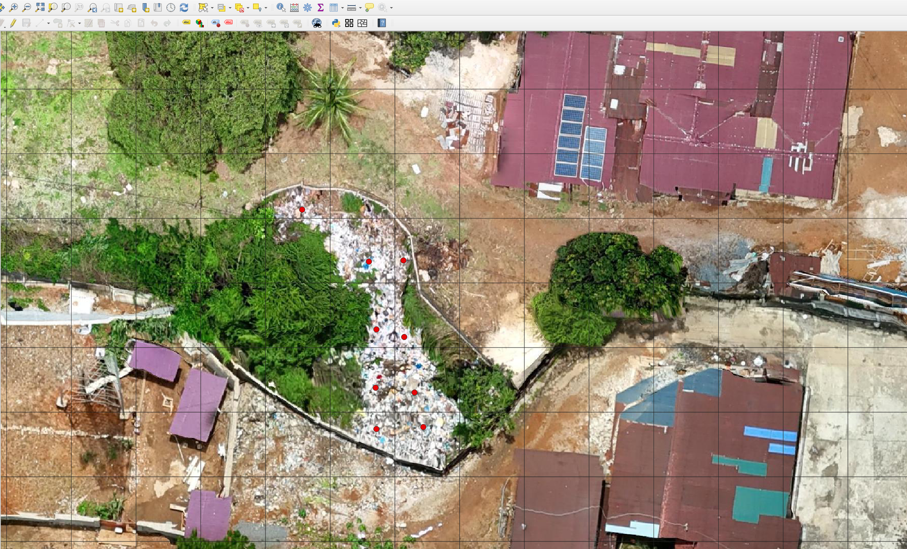
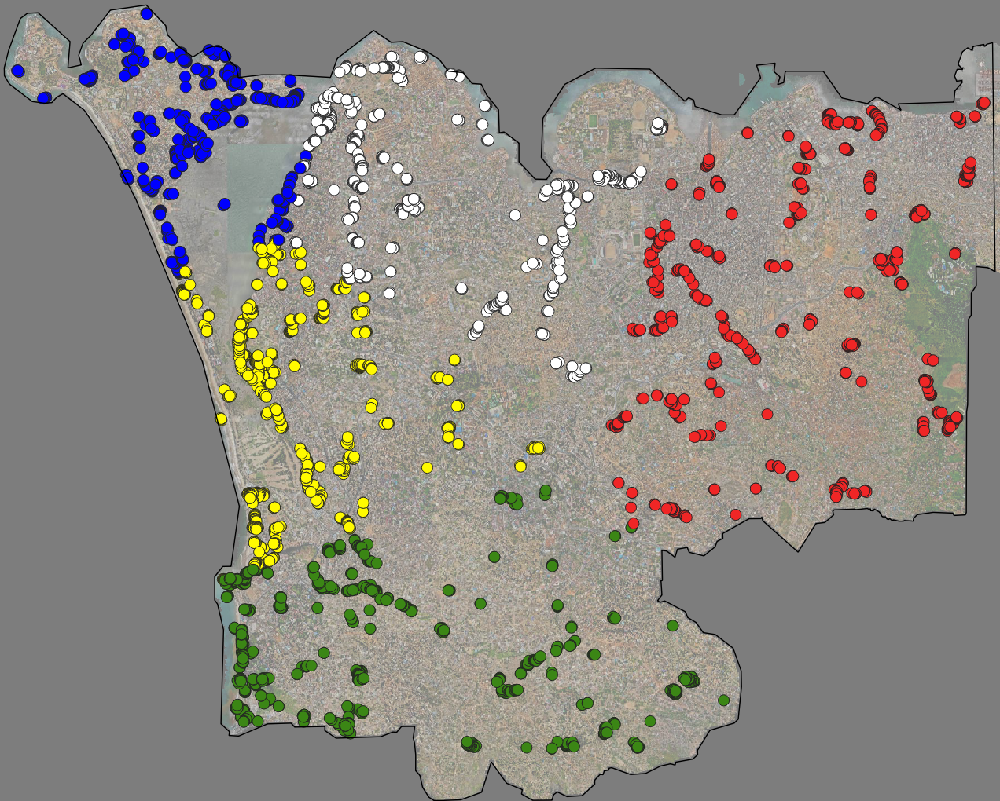

# **Overview**
The aim of this project is to identify illegally dumped waste in Freetown, Sierra Leone. The project was carried out using a machine learning approach (YOLO v11). The repository includes all relevant code.

The **src** directory contains a set of functions, and these functions are run — and outputs are saved — through the files in the **notebooks/** directory.

Functions in **src/data** are executed in **notebooks/data**, and functions in **src/models** are executed in **notebooks/models.qmd**. In this way, the **src** and **notebooks** directories correspond to each other.

Because the workflow moves back and forth between QGIS and Python, please refer to the **# WORKFLOW** section for more details.


# **Project Folder Structure**
```
PROJECT/
├── data/
│   ├── raw/
│   │   ├── boundary/              # project boundary 
│   │   ├── geotiff/               # Original large geotiff images
│   │   ├── grids/                 # Spatial grids
│   │   ├── images/
│   │   │   ├── base/
│   │   │   │   ├── train/
│   │   │   │   └── val/
│   │   │   ├── cv1/
│   │   │   │   ├── train/
│   │   │   │   └── val/
│   │   │   └── images_test/
│   │   │       ├── base/
│   │   │       │   └── test/
│   │   │       ├── cv1/
│   │   │       │   └── test/
│   │   │       │── ...           
│   │   │       │
│   │   │       └── cv5/
│   │   │           └── test/
│   │   │
│   │   ├── points/                # Annotated points
│   │   ├── tiles/                 # Image tiles 
│   │   └── waterway/              # Waterway gpkg file
│   │
│   └── intermediate/
│       ├── density/               # density data
│       ├── moran/                 # Moran's I results (5m & 20m grids)
│       ├── predicted_tiles/       # all predicted tiles
│       ├── scv/                   # spatial cross-validation points
│       ├── tiles_png/             # all PNG tiles 
│       └── tiles_test/            # tiles for F1 score calculation
│
├── notebooks/
│   ├── data.qmd                   # data preprocessing
│   ├── analysis.qmd               
│   ├── models.qmd                 # model training, evaluation, and prediction
│   └── visualization.qmd
│
├── src/
│   ├── data/
│   │   ├── assign_file_base.py
│   │   ├── assign_file_cv.py
│   │   ├── clustering.py
│   │   ├── convert_tif_to_png.py
│   │   └── split_images.py
│   │
│   ├── analysis/
│   │   ├── calculate_waste_density_grids.py
│   │   ├── moran.py
│   │   └── waterway_analysis.py
│   │
│   ├── models/
│   │   ├── check_f1_score.py
│   │   ├── detect_valid_tiles.py
│   │   ├── predict_all_tiles.py
│   │   └── yolo_11v_cls.py
│   │
│   └── visualisation/
│       ├── figure2_moran_plot.py
│       ├── table1_scv.py
│       ├── table2_local_moran.py
│       └── table3_waterway.py
│
├── models/
│   └── runs/
│       └── batch8_imgsz256/
│           ├── base/              # random sampling model
│           ├── cv1/               # spatial CV fold 1
│           ├── cv2/               # spatial CV fold 2
│           └── ...
│
└── output/
    └── f1_score/
        ├── summary_yolo_batch8_imgsz256_base.csv
        └── summary_yolo_batch8_imgsz256_cv.csv
```

<!-- 
# **Project Folder Structure(Omitted)**


data/
  raw/
  intermdiate/
src/ # Function scripts
  analysis/.
  data/.
  models/.
  visualization/.
notebooks/ # Execution scripts
  analysis.qmd
  data.qmd
  models.qmd
  visualization.qmd
models/ # Trained model outputs
output/ # Result outputs (e.g., F1 scores) -->

---


# **Data Overview**

# Project Data Overview

## 1. Geo Data
**Source:** OpenAerialMap  
**Data ID:** `69075f1de47603686de24fe8`  
**Image Viewer:**  
[OpenAerialMap Image Link](https://map.openaerialmap.org/#/-13.27618360519409,8.482474538571994,15/square/033321123222113100/69075f1de47603686de24fe8?_k=t1hoyf)  

---

## 2. Grid Data
**Creation Method:**  
QGIS → Vector → Research Tools → Create Grid (5m*5m)

**Google Drive Folder:**  
[Grid Data Folder](https://drive.google.com/drive/folders/1uq5wtD4CiXPRjCRfOn723Q1kq4544kBT?usp=sharing)  

---

## 3. Annotation Data
**Method:** Manual annotation using QGIS 

**Access Path:**  
Points → merged.gpkg

**Google Drive Folder:**  
[Annotation Data Folder](https://drive.google.com/drive/folders/1uq5wtD4CiXPRjCRfOn723Q1kq4544kBT?usp=sharing)  

---

## 4. Waterway Data
**Source:** QGIS plugin – QuickOSM  

**Access Path:**  
QGIS → Vector → QuickOSM  

**Key Filter:** `[waterway]`  

**Plugin Information:**  
[QuickOSM Plugin Page](https://plugins.qgis.org/plugins/QuickOSM/#plugin-about)


# **Workflow**

## **1. Image Preparation**

### **1.1 [Python] Split images into tiles**

Breaks large images into smaller tile subsets for processing.

* **Input:**
  `data/raw/geotiff/690585b76415e43597ffd7eb.tif.tif`
* **Output:**
  `data/raw/tiles/*.tif`
* **Function:**
  `src/data/split_images.py`
* **Notebook:**
  `notebooks/data.qmd`

---

### **1.2 [QGIS] Annotate points**

Manual annotation of waste / non-waste locations on raw imagery tiles.

* **Input:**
  `data/raw/geotiff/690585b76415e43597ffd7eb.tif.tif`
* **Output:**
  `data/raw/merged.gpkg`
* **Notebook:**
  —

<center>
  
</center>

---

### **1.3 [Python] Assign files to folders**

Sorts annotated tiles into training/validation/test folders for model input.

* **Input:**
  `data/raw/merged.gpkg`
* **Outputs:**
  `data/raw/images/`
  `data/raw/images_test/`
* **Function:**
  `src/data/assign_files_base.py`
  `src/data/assign_files_cv.py`
* **Notebook:**
  `notebooks/data.qmd`

---

### **1.4 [Python] Convert `.tif` → `.png` for testing**

Creates PNG test images for YOLO inference and prediction analysis.

* **Input:**
  `data/raw/images_test/`
  `data/raw/tiles/`
* **Output:**
  `data/intermediate/images_test/`
  `data/intermediate/tiles_png/`
* **Function:**
  `src/data/convert_tif_to_png.py`
* **Notebook:**
  `notebooks/data.qmd`

---

## **2. Spatial Cross-Validation**

### **2.1 [Python] Generate spatial folds (k-means clustering)**

Creates spatial cross-validation groups based on clustering of image tile coordinates.

* **Input:**
  `data/raw/merged.gpkg` 

* **Output:**
  `data/intermediate/points_for_cv.gpkg`

* **Function:**
  `src/data/clustering.py`

* **Notebook:**
  `notebooks/data.qmd`

<!-- {width=500px} -->

<center>
  
</center>


---

## **3. Model Training and Evaluation**

### **3.1 [Python] Train YOLO models**

Trains YOLO image classification models using baseline and spatial CV datasets.

* **Input:**
  `data/raw/images/`

* **Output:**
  `models/runs/batch8_imgsz256/base/`
  `models/runs/batch8_imgsz256/cv1/`
  `models/runs/batch8_imgsz256/cv2/`
  `…`

* **Function:**
  `src/models/yolo_11v_cls.py`

* **Notebook:**
  `notebooks/models.qmd`

---

### **3.2 [Python] Compute F1 scores**

Evaluates YOLO model accuracy using precision/recall metrics and summarizes performance of random sampling and across CV folds.

* **Input:**
  `data/raw/images_test/`
  `models/runs/batch8_imgsz256/base/`
  `models/runs/batch8_imgsz256/cv*/`

* **Output:**
  `output/f1_score/summary_yolo_batch8_imgsz256_base.csv`
  `output/f1_score/summary_yolo_batch8_imgsz256_cv.csv`

* **Function:**
  `src/models/check_f1_score.py`

* **Notebook:**
  `notebooks/models.qmd`

---

### **3.3 [Python] Predict across all tiles**

Generates YOLO predictions for every image tile in the dataset and exports results as a .txt files.

* **Input:**
  `data/intermediate/tiles_png/`

* **Output:**
  `data/intermediate/predicted_all_tiles/predict/labels/*txt`

* **Function:**
  `src/models/predict_all_tiles.py`

* **Notebook:**
  `notebooks/models.qmd`

---

### **3.4 [Python] Filter tiles by confidence threshold**

Selects high-confidence YOLO detections and saves only valid waste predictions.

* **Input:**
  `data/intermediate/predicted_all_tiles/predict/labels/*txt`

* **Output:**
  `data/intermediate/predicted_tiles/results_all_tiles_97.gpkg`

* **Function:**
  `src/models/detect_valid_tiles.py`

* **Notebook:**
  `notebooks/models.qmd`


---

## **4. Spatial Autocorrelation (Moran's I)**

### **4.1 [QGIS] Convert predicted waste grids to point centroids**

Transforms grid polygons into centroid point geometries for spatial autocorrelation analysis.

* **Input:**
  `data/intermediate/predicted_tiles/results_all_tiles_97.gpkg`

* **Output:**
  `data/intermediate/predicted_tiles/results_all_tiles_points.gpkg`

* **Function:**
  —

* **Notebook:**
  —

---


### **4.2 [Python] Calculate waste density per grid size**

Computes waste density statistics for multiple spatial grid resolutions.

* **Input:**
  `data/raw/grid/moran_10` 
  `data/raw/grid/moran_20` 
  `data/raw/grid/moran_30` 
  `data/raw/grid/moran_40` 
  `data/intermediate/predicted_tiles/results_all_tiles_points.gpkg`

* **Output:**
  `data/intermediate/density/waste_density_10.gpkg`
  `data/intermediate/density/waste_density_20.gpkg`
  `data/intermediate/density/waste_density_30.gpkg`
  `data/intermediate/density/waste_density_40.gpkg`

* **Function:**
  `src/analysis/calculate_waste_density_grids.py`

* **Notebook:**
  `notebooks/analysis.qmd`

---

### **4.3 [Python] Compute Global Moran’s I using grid density values**

Measures global spatial clustering patterns using waste density values across grid cells.

* **Input:**
  `data/intermediate/predicted_tiles/results_all_tiles_97.gpkg`
  `data/intermediate/density/waste_density_10.gpkg`
  `data/intermediate/density/waste_density_20.gpkg`
  `data/intermediate/density/waste_density_30.gpkg`
  `data/intermediate/density/waste_density_40.gpkg`

* **Output:**
  `data/intermediate/predicted_tiles/results_all_tiles_points.gpkg`

* **Function:**
  `src/analysis/moran.py`

* **Notebook:**
  `notebooks/analysis.qmd`

---

### **4.4 [Python] Compute Local Moran’s I (5 m and 20 m grids)**

Identifies local spatial clusters and outliers at different grid sizes.

* **Input:**
  `data/intermediate/predicted_tiles/results_all_tiles_97.gpkg`
  `data/intermediate/density/waste_density_20.gpkg`

* **Output:**
  `data/intermediate/moran/waste_moran_5.gpkg`
  `data/intermediate/moran/waste_moran_20.gpkg`

* **Function:**
  `src/analysis/moran.py`

* **Notebook:**
  `notebooks/analysis.qmd`

---

## **5. Waterway Analysis**

### **5.1 [QGIS] Extract waterways from OpenStreetMap**

Retrieves waterway features (e.g., rivers, streams) for spatial intersection analysis.

* **Input:**
  — 

* **Output:**
  `data/raw/waterway/waterways.gpkg`

* **Function:**
  —

* **Notebook:**
  —

---

### **5.2 [QGIS] Create buffer zones**

Generates buffer polygons around waterways to determine proximity relationships.

* **Input:**
  `data/raw/waterway/waterways.gpkg`

* **Output:**
  `data/raw/waterway/buffer_waterway.gpkg`

* **Function:**
  —

* **Notebook:**
  —

---

### **5.4 [Python] Identify waste points within buffer regions**

Detects waste hotspots located near waterways and exports results for interpretation.

* **Input:**
  `data/intermediate/moran/waste_moran_5.gpkg`
  `data/raw/waterway/buffer_waterway.gpkg`

* **Output:**
  `data/intermediate/waterway/waste_points_waterway.gpkg` 

* **Function:**
  `src/analysis/waterway_analysis.py`

* **Notebook:**
  `notebooks/analysis.qmd`

---